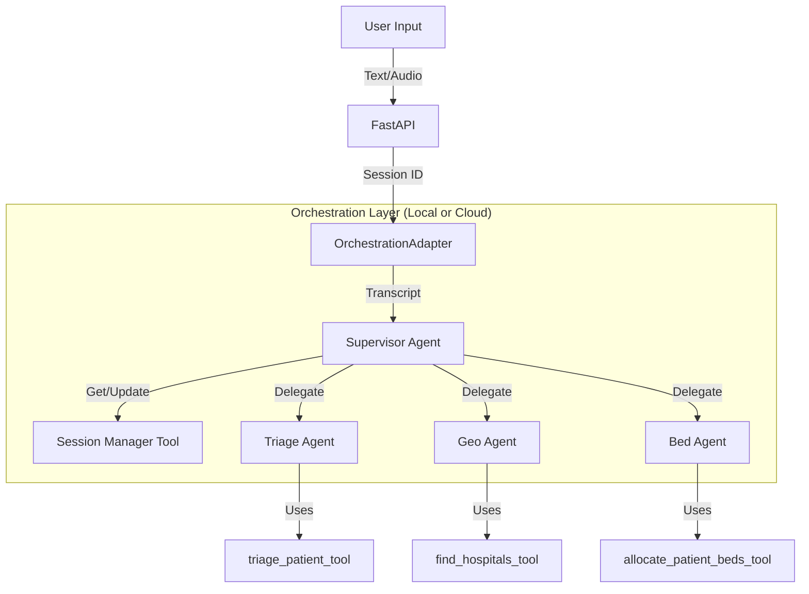

# Hybrid Orchestrate Implementation - Complete Guide

## Overview

Respondr.ai now uses **hybrid watsonx Orchestrate** with environment-based mode switching:

- **Local Mode** (`ORCHESTRATE_MODE=local`) - Testing/demo with custom logic
- **Production Mode** (`ORCHESTRATE_MODE=production`) - Cloud Orchestrate instance

## Architecture



## Files Created/Modified

### New Files

1. **`orchestrate_adapter.py`** - Unified orchestration interface
   - Handles switching between Local and Production modes
   - Implements local Supervisor logic mirroring cloud agent

2. **`tools/session_tool.py`** - Session state management
   - `manage_session_tool`: Get/Update/Complete sessions

3. **Agent Definitions (YAML)**
   - `agents/supervisor.yaml`
   - `agents/triage_agent.yaml`
   - `agents/geo_agent.yaml`
   - `agents/bed_agent.yaml`

### Modified Files

4. **`tools/` Directory** - Self-contained tools
   - `triage_tool.py`: watsonx.ai integration
   - `geo_tool.py`: MongoDB geospatial queries
   - `bed_tool.py`: Bed allocation logic

5. **`main.py`** - API Entry Point
   - Integrated `OrchestrationAdapter`
   - Handles Session ID generation

6. **`.env`** - Configuration
   - Added `ORCHESTRATE_MODE`, `ORCHESTRATE_AGENT_ID`


---

## Environment Configuration

### Local Mode (Testing/Demo)

```.env
# Orchestrate Mode
ORCHESTRATE_MODE=local

# Only watsonx.ai credentials needed
WATSONX_API_KEY=your-api-key
WATSONX_PROJECT_ID=your-project-id
```

### Production Mode (Cloud Orchestrate)

````.env
# Orchestrate Mode
ORCHESTRATE_MODE=production

# Cloud Orchestrate credentials
ORCHESTRATE_INSTANCE_URL=https://your-instance.orchestrate.ibm.com
ORCHESTRATE_AGENT_ID=your-agent-id-123
ORCHESTRATE_API_KEY=your-orchestrate-key

# watsonx.ai still needed for tools
WATSONX_API_KEY=your-api-key
WATSONX_PROJECT_ID=your-project-id
```

---

## Usage

### Switch to Local Mode
```bash
export ORCHESTRATE_MODE=local
# Restart server
uvicorn main:app --reload
```

### Switch to Production Mode
```bash
export ORCHESTRATE_MODE=production
# Set Orchestrate credentials
export ORCHESTRATE_INSTANCE_URL=https://...
export ORCHESTRATE_AGENT_ID=agent-123
export ORCHESTRATE_API_KEY=...
# Restart server
uvicorn main:app --reload
```

---

## Tool Decorators

All tools now have `@tool` decorator for Orchestrate compatibility:

```python
from ibm_watsonx_orchestrate.decorators import tool

@tool
def triage_patient_tool(transcript: str, context: dict) -> dict:
    """
    Classify casualties using START Protocol.
    
    Args:
        transcript (str): Radio report
        context (dict): Session context
    
    Returns:
        dict: Triage classification
    """
    # Implementation
```

**Benefits:**
- ✅ Works in local mode (called directly)
- ✅ Works in production mode (registered with Orchestrate)
- ✅ Same implementation for both modes

---

## API Response

Both modes return unified response with mode indicator:

```json
{
  "session_id": "demo-001",
  "action": "location_updated",
  "message": "Location confirmed",
  "orchestration_mode": "local",  // or "production"
  "triage_result": null,
  "allocation_result": null
}
```

---

## Fallback Mechanism

If production mode fails, automatically falls back to local:

```
1. Try CloudOrchestrator
2. If error → Log warning
3. Fall back to LocalOrchestrator
4. Add "mode": "local (fallback)" to response
```

**Disable fallback:** Set `fallback_enabled = False` in adapter

---

## Testing

### Test Local Mode
```bash
# Set local mode
export ORCHESTRATE_MODE=local

# Test transcript
curl -X POST http://localhost:8000/api/radio/text \
  -H "Content-Type: application/json" \
  -d '{"transcript": "Unit 1 at -1.29, 36.82"}'

# Check response has "orchestration_mode": "local"
```

### Test Production Mode
```bash
# Set production mode  
export ORCHESTRATE_MODE=production
export ORCHESTRATE_INSTANCE_URL=...

# Same test
curl -X POST http://localhost:8000/api/radio/text \
  -H "Content-Type: application/json" \
  -d '{"transcript": "Unit 1 at -1.29, 36.82"}'

# Check response has "orchestration_mode": "production"
```

---

## Next Steps: Cloud Orchestrate Setup

To enable production mode, you need to deploy the swarm:

1. **Deploy Tools**:
   ```bash
   orchestrate tools import -k python -f tools/triage_tool.py -r tools/requirements.txt
   orchestrate tools import -k python -f tools/geo_tool.py -r tools/requirements.txt
   orchestrate tools import -k python -f tools/bed_tool.py -r tools/requirements.txt
   orchestrate tools import -k python -f tools/session_tool.py -r tools/requirements.txt
   ```

2. **Deploy Agents**:
   ```bash
   orchestrate agents import -f agents/triage_agent.yaml
   orchestrate agents import -f agents/geo_agent.yaml
   orchestrate agents import -f agents/bed_agent.yaml
   orchestrate agents import -f agents/supervisor.yaml
   
   orchestrate agents deploy -n "Triage Agent"
   orchestrate agents deploy -n "Geo Agent"
   orchestrate agents deploy -n "Bed Agent"
   orchestrate agents deploy -n "Supervisor Agent"
   ```

3. **Get Supervisor Agent ID**:
   - From Orchestrate CLI or UI
   - This is the ONLY ID the backend needs to know

4. **Update .env**:
   ```bash
   ORCHESTRATE_MODE=production
   ORCHESTRATE_AGENT_ID=your-supervisor-agent-id
   ```

5. **Test**:
   - Restart server and send requests
   - Backend now talks to the Cloud Supervisor!

---

## Cloud Orchestrate Implementation (TODO)

The `CloudOrchestrator` class has a placeholder implementation. To complete:

```python
# Install Orchestrate client SDK
from ibm_watsonx_orchestrate import OrchestrateClient

class CloudOrchestrator:
    def __init__(self):
        self.client = OrchestrateClient(
            instance_url=settings.orchestrate_instance_url,
            api_key=settings.orchestrate_api_key
        )
    
    async def process_transcript(self, transcript, session_id):
        response = await self.client.send_message(
            agent_id=self.agent_id,
            session_id=session_id,
            message=transcript
        )
        return response.to_dict()
```

**Note:** Actual SDK methods may differ - consult Orchestrate documentation.

---

## Benefits Summary

✅ **Flexibility** - Switch modes without code changes
✅ **Testing** - Full local testing without cloud dependency
✅ **Production** - Enterprise Orchestrate features when needed
✅ **Compatibility** - Tools work in both modes
✅ **Resilience** - Automatic fallback to local
✅ **Migration** - Gradual shift from local to production

---

**Hybrid Orchestrate ready!** Toggle with ORCHESTRATE_MODE environment variable.
